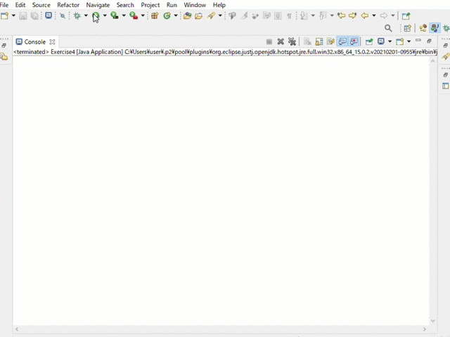

# JavaAPI 復習問題

### 登場する分野
* String API
* BufferedReader
* Map
* 例外処理

### 事前準備
1. 「javaExercise」でJavaプロジェクトを作成する。
1. パッケージは「Exercise」を作成する。
1. book.csvをCドライブの「exercise」フォルダに置く。※フォルダが無い場合は新規作成してください
[book.csv](/book.csv)

### 作成するもの
簡単な本購入システムです。  
本の一覧を表示し、本の番号を入力すると購入することができます。  
存在しない本の番号を入力したり、未入力の場合は購入できません。

***
### 最終完成挙動

 

***

## [Exercise1](exercise1.md)
[解答](src/Exercise1.java)

 

## [Exercise2](exercise2.md)
[解答](src/Exercise2.java)

 

## [Exercise3](exercise3.md)
[解答](src/Exercise3.java)

 

## [Exercise4](exercise4.md)
[解答](src/Exercise4.java)
