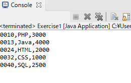
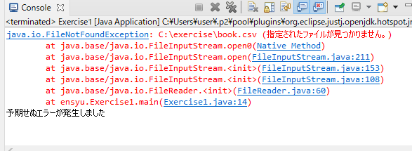

# Exercise1 
book.csvには本情報が記入されています。  
## 1. csvファイルを読み込み、コンソールに本情報の一覧を表示させてください。 
以下の通りに作成してください。 
* Exercise1.java を作成してください。 
* 例外処理にはtry-with-resourcesを使用してください。
* 例外発生時は「予期せぬエラーが発生しました」を表示させてください。  
* 読み込みにはBufferedReaderを使用してください。  
* 余裕があればひな形を使用せずチャレンジしてみてください。  

<br>

<details><summary>★ひな形はこちら</summary><div>

```java:Exercise1.java 
package Exercise;

import java.io.BufferedReader;
import java.io.FileReader;
import java.io.IOException;

public class Exercise1 {
	public static void main(String[] args) {
		// CSVファイルパス
		String path = "C:\\exercise\\book.csv";

		// try-with-resources
		??? (??? br = new ???(new FileReader(path))) {
			// 1行ずつ読み込み
			String line = br.???();
			// 行が存在する（=nullでない）場合は出力と読み込みを実施
			??? (line != null) {
				// 出力
				System.out.println(???);
				// 次の1行を読み込み
				line = br.???();
			}
		} ??? (IOException e) {
			// 例外発生時はこの処理を実施
			e.printStackTrace();
			System.out.println("予期せぬエラーが発生しました");
		}
	}
}

```
</div>
</details>  

<br>

## 2. 1が完成したら、エクスプローラーのbook.csvを削除して実行してみてください。  
## 例外がcatheされて、「予期せぬエラーが発生しました」が表示されます。 

<br>

***  

### 実行結果
1  
  
2  
  

> ※注意  
> 削除したbook.csvは再び使用するのでCtrl + zでファイルを復活させておいてくださいね。