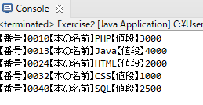

## Exercise3 
Exercise2の機能はそのままで、ソースを修正します。 

***  

### 実行結果
exercise2と同じです。  
  

*** 
<br>

## 1. Exercise2で作成した本情報を整形して出力する処理を、mainメソッドと別メソッドにして切り分けてください。 
以下の通りに作成してください。 
* Exercise3.java を作成してください。 
* ひな形を使用してください。
* 新しく作成するメソッドの定義です。  

| メソッド名 | 引数 | 戻り値 |
|:-----------|:------------|:------------|
| systemOutPreBookData       | 文字列配列        | なし         |  

 <br>
 
<details><summary>★ひな形はこちら</summary><div>

```java:Exercise1.java 
package Exercise;

import java.io.BufferedReader;
import java.io.FileReader;
import java.io.IOException;

public class Exercise3 {

	public static void main(String[] args) {
		// CSVファイルパス
		String path = "C:\\exercise\\book.csv";

		// try-with-resources
		try (BufferedReader br = new BufferedReader(new FileReader(path))) {

			// 1行ずつ読み込み
			String line = br.readLine();
			// 行が存在する（=nullでない）場合は出力と読み込みを実施
			while (line != null) {
				// カンマで区切る
				String[] books = line.split(",");
				// 出力メソッド呼び出し
				systemOutPreBookData(???));
				// 次の1行を読み込み
				line = br.readLine();
			}

		} catch (IOException e) {
			// 例外発生時はこの処理を実施
			e.printStackTrace();
			System.out.println("予期せぬエラーが発生しました");
		}
	}

	/**
	 * 本情報を整形して出力するメソッド
	 * 
	 * books String[] csvファイルの1行をカンマ区切りにした配列
	 */
	static ??? systemOutPreBookData(???) {
		???
	}
}


```
</div>
</details>  

<br>

*** 

*ヒント*
1. 戻り値なしはvoidです。
1. 引数には、カンマ区切りにした配列を渡します。

<br>

*もっとヒント*  
systemOutPreBookDataメソッドの中には以下を書きます。

```java
// 出力
for (int i = 0; i < books.length; i++) {
	String str = "【番号】";
	if (i == 1) {
			str = "【本の名前】";
	} else if (i == 2) {
		str = "【値段】";
	}
	System.out.print(str + books[i]);
}
// 改行
System.out.println();

```

> ★補足  
> 出力処理が少し複雑な処理だったのでメソッドを切り分けました。  
> mainメソッドも長くならず見やすくなりました。  
> 今後出力処理に仕様変更がある場合は、systemOutPreBookDataメソッドのみを修正すれば良いので、mainメソッドの他処理（ファイル読み込みなど）にバグが潜む可能性も減らせました。  