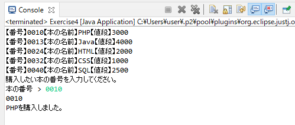
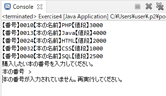
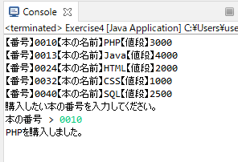
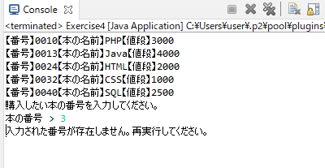

# Exercise4 
Exercise3の機能はそのままで、機能を追加します。  
購入したい本の番号を標準入力で受け取り、受けとった値をもとに、購入メッセージとして本の名前をコンソール出力する機能です。  
また、入力された値によってコンソール出力されるメッセージが異なるようにします。  
***  
## 実行例  

***  

<br>

## 1. 標準入力を受け取るメソッドを追加します。
以下の通りに作成してください。 
* Exercise4.java を作成してください。 
* ひな形をコピペしてください。  

<details><summary>★ひな形はこちら</summary><div>

```java:Exercise1.java 
package Exercise;

import java.io.BufferedReader;
import java.io.FileReader;
import java.io.IOException;
import java.util.HashMap;
import java.util.Map;

public class Exercise4 {

	public static void main(String[] args) {
		// CSVファイルパス
		String path = "C:\\exercise\\book.csv";

		// try-with-resources
		try (BufferedReader br = new BufferedReader(new FileReader(path))) {

			Map<String, String> bookMap = new HashMap<>();

			// 1行ずつ読み込み
			String line = br.readLine();
			// 行が存在する（=nullでない）場合は出力と読み込みを実施
			while (line != null) {

				// カンマで区切る
				String[] books = line.split(",");
				// 出力
				systemOutPreBookData(books);

				// Mapに値を保持
				for (int i = 0; i < books.length; i++) {
					bookMap.put(books[0], books[1]);
				}
				// 次の1行を読み込み
				line = br.readLine();
			}

			// 標準入力を受け取る
			String inputStr = getSystemIn();

		} catch (IOException e) {
			// 例外発生時はこの処理を実施
			e.printStackTrace();
			System.out.println("予期せぬエラーが発生しました");
		}
	}

	/**
	 * 本情報を整形して出力する
	 * 
	 * @param books String[] csvファイルの1行をカンマ区切りにした配列
	 */
	static void systemOutPreBookData(String[] books) {

		// 出力
		for (int i = 0; i < books.length; i++) {
			String str = "【番号】";
			if (i == 1) {
				str = "【本の名前】";
			} else if (i == 2) {
				str = "【値段】";
			}
			System.out.print(str + books[i]);
		}
		// 改行
		System.out.println();
	}

	/**
	 * 標準入力を取得する
	 * 
	 * @return String 標準入力
	 */
	@SuppressWarnings("resource")
	static String getSystemIn() {
		System.out.println("購入したい本の番号を入力してください。");
		// 標準入力を受け取る
		java.util.Scanner scanner = new java.util.Scanner(System.in);
		System.out.print("本の番号 > ");
		return scanner.nextLine();
	}

}

```
</div>
</details>  

<br>
<br>

## 2. 標準入力から受け取った本の番号をもとに、本の名前をコンソールに出力する必要があります。  
## CSVファイルから読み取ったタイミングで本の情報を保存しておきましょう。  
以下の通りに作成してください。
* Mapを使用してください。
* キーは本番号、バリューは本の名前です。  

<br>

## 3. 購入メッセージを出力するメソッドを作成します。 
以下の通りに作成してください。 
* 新しく作成するメソッドの定義です。  

| メソッド名 | 引数 | 戻り値 |
|:-----------|:------------|:------------|
| systemOutBuyMessage       | 文字列（標準入力から受け取った値）, 2で作成したMap（本番号と名前）        | なし         |  

<br>

* 条件によって違うメッセージを出力させてください。  

| 条件 | メッセージ |
|:-----------|:------------|
| 引数が空文字（文字数が0）の場合    | 本の番号が入力されていません。再実行してください。       | 
| Mapに引数が含まれている場合    | 本の名前 + を購入しました。       | 
| Mapに引数が含まれていない場合    | 入力された番号が存在しません。再実行してください。       | 

<br>

※引数が空文字の判定はStringのメソッドを使用してください。  
※Mapに引数が含まれている場合の判断は、Mapのメソッドを使用してください。  
※本の名前はMapから取得してください。  

<br>

* 以下のように標準入力を受け取るメソッドを呼び出した後に呼び出してください。

```java
// 標準入力を受け取る
String inputStr = getSystemIn();

// 購入メッセージ表示
systemOutBuyMessage(???, ???);
```

<br>

***  

### 実行結果
引数が空文字（文字数が0）の場合：何も入力しない  
  
Mapに引数が含まれている場合：「0001」を入力  
  
Mapに引数が含まれていない場合：「3」を入力  
  

*** 

<br>

*ヒント*
1. Mapの初期化はwhile文の上で行います。whileの処理ブロックの中に定義した変数は、while処理ブロック外で参照することができません。
1. books変数をfor文でループさせて、マップにキーとバリューを設定します。
1. 戻り値なしのメソッドでもreturnを記述できます。その時点で処理は呼び出し元に返ります。

<br>

*もっとヒント*  
tryの処理ブロックの中は以下のようになります。

```java

Map<String, String> bookMap = new HashMap<>();

// 1行ずつ読み込み
String line = br.readLine();
// 行が存在する（=nullでない）場合は出力と読み込みを実施
while (line != null) {

	// カンマで区切る
	String[] books = line.split(",");
	// 出力
	systemOutPreBookData(books);

	// Mapに値を保持
	??? (int i = 0; i < ???; i++) {
		bookMap.???(???, ???);
	}
	// 次の1行を読み込み
	line = br.readLine();
}

// 標準入力を受け取る
String inputStr = getSystemIn();

// 購入メッセージ表示
systemOutBuyMessage(???, ???);

```  

systemOutBuyMessageのメソッドは以下のようになります。

```java
/**
	 * 購入メッセージを出力する
	 * 
	 * @param inputStr String 標準入力
	 * @param bookMap 本の情報Map
	 */
	static void systemOutBuyMessage(??? inputStr, ??? bookMap) {
		if (inputStr.???) {
			System.out.println("本の番号が入力されていません。再実行してください。");
			return;
		}
		if (bookMap.???(inputStr)) {
			String bookName = bookMap.???(inputStr);
			System.out.println(bookName + "を購入しました。");
		} else {
			System.out.println("入力された番号が存在しません。再実行してください。");
		}
	}
```  